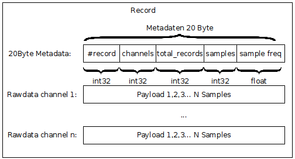

# CUDA Range-Doppler Processing

This project provides CUDA-based source code to process radar data from an FMCW-radar into range and range-Doppler maps. Furthermore, the project includes various benchmarks that measure the execution time of the present algorithms, the used CUDA-kernel, 1D FFTs based on the cufft library and memory bandwidth.  

## Getting Started

To get started with the project some requirements are necessary to install.

### Requirements

* Just tested in Ubuntu 18.04 LTS
* CUDA 9.1 or later versions and a CUDA capable GPU - installation guide for the [latest version](https://docs.nvidia.com/cuda/cuda-installation-guide-linux/index.html)
* GCC/G++ Compiler 6.3 or later versions - [installation guide](https://linuxize.com/post/how-to-install-gcc-compiler-on-ubuntu-18-04/)
* CSNET GPUJPEG library - source code and installation guide can be found [here](https://github.com/CESNET/GPUJPEG)

### Installing

If the requirements are met, the project can be installed as follows.

1.) If the project is not downloaded yet, open a terminal and point to a desired folder ($DIR), otherwise proceed with step 3.)

```
cd $DIR
```
2.) clone the latest release from github
```
git clone https://github.com/NiclasEsser1/CUDARangeDopplerProcessing.git
```
3.) Point the console to the root folder of the project

```
cd CUDARangeDopplerProcessing
```
4.) Compile & build
```
make
```
The project should be compiled. If not, take a closer look into ```makefile``` and verify that the paths of libraries and header are adjusted to your system.

## Running

The project provides an example for offline processing ```bin/offline_processing```.  If the file is executed, processing configurations must be passed to the program. First, a raw data file must be specified. To verify the installation process, a sample file is given.
```
$DIR/samples/raw_sample.dat
```
After you passed the remaining processing arguments, the algorithm is executed on the GPU. You can find the results of the processing in ``$DIR/results/img/``

### Read-out your own raw data

The raw data file corresponds to the default format shown in the Figure below. 

If your raw data does not match this format, feel free to add your own read-out method (e.g ```SignalGenerator::loadMyFile```).


### Benchmarks

The project also contains different benchmarks:

* Benchmark the algorithm (results are displayed within the terminal)
```
$DIR/bin/benchmark_algorithm
```
* Benchmark single CUDA kernels (results can be found in ```$DIR/results/benchmarks/benchmark_kernels.csv```)
```
$DIR/bin/benchmark_kernels
```
* Benchmark  memory bandwidth (results can be found in ```$DIR/results/benchmarks/benchmark_memory_bandwidth.csv```)
```
$DIR/bin/benchmark_memory_bandwidth
```
* Benchmark 1D FFTs (results can be found in ```$DIR/results/benchmarks/benchmark_fft.csv```)
```
$DIR/bin/benchmark_fft
```

### Algorithms Results (tested on Geforce 960m GTX)
 width | height |  Range-Doppler |  Range  
 --------|-------------|----------|------------
   256    |   256  | 2.98 ms |  2.90 ms
   512    |   512  | 3.85 ms |  3.02 ms
   1024    |   1024  | 7.17 ms |  4.9 ms
   2048    |   2048  | 17.92 ms |  10.34 ms
   4096    |   4096  | 68.56 ms | 40.192 ms
   8192    |   4096  | 140.84 ms | 82.14 ms


### More Information
More information can be found in the header files.

## Authors

* **Niclas Esser** - *Initial work* - [NiclasEsser1](https://github.com/NiclasEsser1)

See also the list of [contributors](https://github.com/your/project/contributors) who participated in this project.

## License

No license

## TODOs

* Implement a test class which verifies calculations of GPU-Kernels
* Optimize ```CudaBase::mapColors```, ```CudaBase::fftshift```, ```CudaBase::absolute``` and ```CudaBase::window```
* Add optimized matrix-vector and matrix-matrix multiplication
* Commenting all classes and functions
